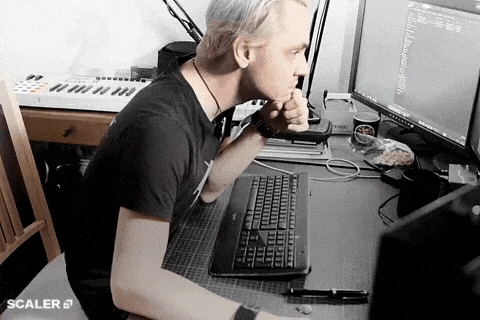

  

# Hi, I'm Zolbayar Byambajav

I'm a junior software engineer building full-stack web and mobile products with React, React Native, TypeScript, and Node.js.

## About me

- Recently completed software engineering training at Pinecone Academy
- Built and shipped features across web, mobile, and API-driven projects
- Interested in full-stack development, mobile apps, AI-assisted tools, and clean product experiences
- Open to collaboration, internships, junior software roles, and useful project ideas

## Tech I use

## Highlights

- Built a 2nd-place PineQuest S3 Hackathon project: an AI-powered LMS exam platform with mobile proctoring, real-time cheat alerts, PDF question extraction, and teacher/student workflows
- Contributed to camera-based detection, learning, and practice flows using MediaPipe and dataset handling
- Worked across full-stack product features with Next.js, React, GraphQL, Prisma, and PostgreSQL

---

Thanks for visiting my profile.

